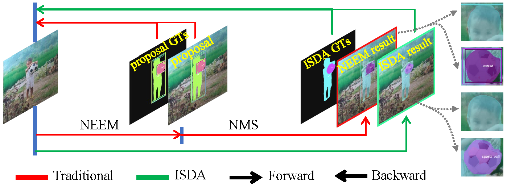

# ISDA

This repository maintains the official implementation of the **ICASSP'2022** paper [**ISDA: Position-Aware Instance Segmentation with Deformable Attention**](https://arxiv.org/pdf/2202.12251.pdf)  by [Kaining Ying](https://github.com/yingkaining), [Zhenhua Wang](http://www.homepage.zjut.edu.cn/wzh/), [Bai Cong](http://www.homepage.zjut.edu.cn/congbai/) and [Pengfei Zhou](https://scholar.google.com/citations?user=FLKP0NsAAAAJ&hl=zh-CN).

<div align="center">
  
</div>

## Update

- [x] [2022/3/24] First update!

## Prerequisites

- Linux
- Python 3.8+
- PyTorch 1.10.0+
- CUDA 10.1+
- GCC 5+
- [MMCV](https://mmcv.readthedocs.io/en/latest/#installation)

## Installation

### Prepare environment

1. Create a conda virtual environment and activate it.

    ```shell
    conda create -n isda python=3.8 -y
    conda activate isda
    ```

2. Install PyTorch and torchvision following the [official instructions](https://pytorch.org/), e.g.,

    ```shell
    conda install pytorch=1.10.0 torchvision=0.11.1 cudatoolkit=11.1 -c pytorch -y
    ```


3. Install mmcv-full.

   ```
   pip install mmcv-full -f https://download.openmmlab.com/mmcv/dist/{cu_version}/{torch_version}/index.html
   ```

   Please replace `{cu_version}` and `{torch_version}` in the url to your desired one. For example, to install the latest `mmcv-full` with `CUDA 11.1` and `PyTorch 1.10.0`, use the following command:

   ```
   pip install mmcv-full -f https://download.openmmlab.com/mmcv/dist/cu111/torch1.10.0/index.html
   ```

4. See [here](https://github.com/open-mmlab/mmcv#installation) for different versions of MMCV compatible to different PyTorch and CUDA versions.

5. Clone the ISDA repository.

      ```
      git clone https://github.com/yingkaining/isda
      cd isda
      ```

6. Install full dependencies and package.

      ```
      pip install -r requirements/build.txt
      pip install -v -e .  # or "python setup.py develop"
      ```

## Getting Strated

### Download and prepare the datasets and pretrained model

We provide a script to download datasets such as COCO , you can run `python tools/misc/download_dataset.py --dataset-name coco2017` to download COCO dataset. You can pretrained model [here](https://download.openmmlab.com/mmdetection/v2.0/deformable_detr/deformable_detr_r50_16x2_50e_coco/deformable_detr_r50_16x2_50e_coco_20210419_220030-a12b9512.pth). 

```
isda
├── mmdet
├── tools
├── configs
├── checkpoints
│   ├── deformable_detr_r50_16x2_50e_coco_20210419_220030-a12b9512.pth
├── data
│   ├── coco
│   │   ├── annotations
│   │   ├── train2017
│   │   ├── val2017
│   │   ├── test2017
```

### Train a model

```
python tools/train.py ./configs/isda/isda_r50_3x_coco.py  # Training with single gpu
tools/dist_train.sh ./configs/isda/isda_r50_3x_coco.py 8 # Distributed Training with 8 gpus
```

### Test a model and evaluate results

```
python tools/test.py ./configs/isda/isda_r50_3x_coco.py ./checkpoints/ --eval segm  # Testing with single gpu
tools/dist_test.sh ./configs/isda/isda_r50_3x_coco.py 8 # Distributed Training with 8 gpus
```

### Demo


## Model Zoo

| Backbone | Model | Download  |
| -------- | ----- | --------- |
| R-50     | ISDA  | [model]() |


## Acknowledgement

Thanks to [openmmlab](https://openmmlab.com/) for providing excellent code base. DETR also provided the framework for my model. Additionally, I was inspired by the work of [Xinglong Wang](https://www.xloong.wang/) and [Prof. Chunhua Shen](https://cshen.github.io/) on SOLO and SOLOv2. Thanks guys!


## Citation

If you find this project useful for your research, please kindly cite our paper.

```
@inproceedings{ying2022isda,
  title={ISDA: Position-Aware Instance Segmentation with Deformable Attention},
  author={Ying, Kaining and Wang, Zhenhua and Bai, Cong and Zhou, Pengfei},
  booktitle={ICASSP 2022-2022 IEEE International Conference on Acoustics, Speech and Signal Processing (ICASSP)},
  pages={2619--2623},
  year={2022},
  organization={IEEE}
}
```


